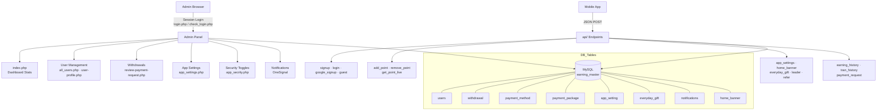

<p align="center">
  
</p>

<p align="center">
  
  
  
</p>

> **Developed by [Arslan Malik](https://github.com/arsalanmaalik461)**
> 📱 WhatsApp: [+92 300 8987448](https://wa.me/923008987448) · 🌐 Website: [arslanmalik.tech](https://arslanmalik.tech)

---

## 🌟 Executive Overview

**Earning Master Admin** is a complete, production-style admin panel for a *watch & earn* rewards mobile app, built in plain PHP with a MySQL backend. It gives the app owner a single web dashboard to manage users, review and approve payment/withdrawal requests, configure payment methods and coin packages, tune in-app security and ad-network settings, push notifications, and track engagement — while a set of lightweight JSON APIs (`api/`) serve the same data directly to the mobile app (settings, banners, leaderboard, points, transaction history, and more).

The codebase is structured around a session-protected admin area: a stats dashboard (`index.php`) showing total users, total paid and total pending; dedicated pages for user management, withdrawals, payment packages, app settings, video-wall and work settings, and a remote-configuration layer for ad monetisation (AdMob, Unity, ironSource, Vungle, AdColony, StartApp) and engagement mechanics like signup/refer bonuses, daily check-in rewards, everyday gifts, and a top-10 leaderboard — all without touching the app code.

---

## 📑 Table of Contents

- [✨ Key Features & Highlights](#-key-features--highlights)
- [🖥️ Feature Showcase](#️-feature-showcase)
- [🏗️ System Architecture](#️-system-architecture)
- [🚀 Quickstart & Installation Guide](#-quickstart--installation-guide)
- [📂 Project Structure](#-project-structure)
- [🛡️ Security & Notes](#️-security--notes)

---

## ✨ Key Features & Highlights

| Feature | Description |
| :--- | :--- |
| 📊 Admin Dashboard | `index.php` shows Total Users, Total Paid and Total Pending at a glance |
| 👥 User Management | Browse all users (`all_users.php`), view detailed profiles (`user-profile.php`), track activity (`user_track.php`) |
| 💸 Withdrawal Review | Approve/reject payout requests via `review-payment-request.php` with pending & paid states |
| 💳 Payment Methods & Packages | Configure payout methods (`payment_method.php`) and coin packages (`payment_package.php`) |
| 🎁 Everyday Gifts & Daily Rewards | Everyday-gift campaign table served to the app through `get_everyday_gift_api.php`; daily check-in rewards configurable in settings |
| 🏆 Leaderboard | Top-10 users by points served by `api/leader.php` with rank handling |
| 📢 Notifications | Compose and send notifications (`notification.php`, `user_notification_send.php`) powered by OneSignal keys |
| 🛡️ App Security Controls | Toggle blocks for rooted devices, VPN access and app cloning (`app_secrity.php`) |
| 📺 Video Wall & Work Settings | Manage the watch-earn video wall (`video_wall_settings.php`) and work/task rewards (`work_settings.php`) |
| 📱 Mobile JSON APIs | Signup, login, Google sign-in, guest mode, points add/remove, earning & transaction history, home banners, refer info |
| 💰 Ad Monetisation Config | Remote ad-unit settings for AdMob, Unity, ironSource, Vungle, AdColony and StartApp — change ad IDs without an app update |

---

## 🖥️ Feature Showcase

### 1. Admin Dashboard & User Management

> *"One screen for the health of the app — users, payouts and pending requests."*

- Stats widgets: **Total Users**, **Total Paid**, **Total Pending** (via `get_total_users.php`)
- Full user list with search (`search.php`) and per-user profile pages with earning activity
- User tracking table (`user_tracking`) for audit-style visibility into account events

### 2. Withdrawals & Payment Configuration

> *"Review every payout request, then approve or reject — paid and pending totals stay in sync."*

- Withdrawal queue with user, package amount, payment coins, payment info and status (`review-payment-request.php`, `withdrawal.php`)
- Payment method management (`add_paymnet_method.php`, `payment_method.php`, `paymentm_add_code.php`)
- Coin/package catalog (`payment_package.php`) with amount, coins and currency symbol columns

### 3. Engagement Engine (Gifts, Leaderboard, Rewards)

> *"Give users reasons to come back every day — gifts, check-ins, referrals and rankings."*

- Everyday-gift API returns active gift campaigns to the app (`get_everyday_gift_api.php`)
- Daily check-in rewards and signup/refer bonuses configurable from `app_settings.php`
- Leaderboard API ranks the top 10 earners by points with tie-aware ranking (`api/leader.php`)

### 4. App Security & Monetisation Settings

> *"Control the app remotely: block abuse, tune ads, update copy."*

- Anti-abuse switches: block rooted devices, VPN access, app-cloned installs (`app_secrity.php`)
- Ad network IDs editable from the panel: AdMob (banner, interstitial, video), Unity, ironSource, Vungle, AdColony, StartApp
- OneSignal push keys, privacy policy text, refer-page copy and ad-frequency counters — all remote-configurable

---

## 🏗️ System Architecture



---

## 🚀 Quickstart & Installation Guide

### Prerequisites

- **PHP** 7.4+ with `mysqli` extension
- **MySQL / MariaDB**
- A local server stack (XAMPP, WAMP, Laragon) or any LAMP hosting

### Step-by-Step Installation

```bash
# 1. Copy the project into your web root, e.g. htdocs/Earning-Master-admin

# 2. Create the database and import the schema
mysql -u root -p -e "CREATE DATABASE earning_master CHARACTER SET utf8mb4;"
mysql -u root -p earning_master < database.sql

# 3. Update DB credentials in connect.php
#    $servername, $username, $password, $dbname ("earning_master")

# 4. Open the panel
http://localhost/Earning-Master-admin/login.php
```

Default admin credentials (from `database.sql`):

| Email | Password |
| :--- | :--- |
| `admin@gmail.com` | `123456` |

> ⚠️ Change the default admin password immediately after first login (`change_password.php`).

Mobile-app endpoints live under `api/` and expect JSON POST requests, e.g. `api/login.php`, `api/signup.php`, `api/leader.php`, `api/get_point_live.php`.

---

## 📂 Project Structure

```
Earning-Master-admin/
├── index.php                  # Admin dashboard (users / paid / pending stats)
├── login.php                  # Admin login form
├── check_login.php            # Session-based login handler
├── logout.php                 # Session destroy
├── change_password.php        # Admin password change
├── connect.php                # MySQL connection (edit credentials here)
├── database.sql               # Full schema + seed data (15 tables)
├── all_users.php              # User list
├── user-profile.php           # Per-user detail page
├── user_track.php             # User activity tracking
├── user_message.php           # User messaging
├── withdrawal.php             # Withdrawal overview
├── user_withdrawal.php        # User withdrawal detail
├── review-payment-request.php # Approve/reject payout requests
├── payment_method.php         # Payout method management
├── add_paymnet_method.php     # Add payout method
├── paymentm_add_code.php      # Payment method codes
├── payment_package.php        # Coin/package catalog
├── watch_earn_list.php        # Watch-earn list
├── video_wall_settings.php    # Video wall configuration
├── work_settings.php          # Task/work reward settings
├── app_settings.php           # App settings page
├── more_app_settings.php      # Extended app settings
├── app_secrity.php            # Anti-abuse toggles (root/VPN/clone)
├── notification.php           # Push notification composer
├── user_notification_send.php # Notification sender
├── get_total_users.php        # Dashboard stats helper
├── message.php                # Flash message helper
├── header.php / footer.php    # Panel layout chrome
├── main_app.php               # App landing snippet
├── api/                       # Mobile-app JSON endpoints
│   ├── login.php / signup.php # Auth (email, Google, guest)
│   ├── add_point.php / remove_point.php
│   ├── leader.php             # Top-10 leaderboard
│   ├── get_everyday_gift_api.php
│   ├── earning_history_api.php / tran_history_api.php
│   ├── payment_request.php    # Withdrawal request from app
│   ├── app_settings.php       # Remote config for the app
│   ├── home_banner.php        # Home banner feed
│   ├── notification_api.php / refer.php / get_user_data.php
│   └── images/                # App-side uploaded images
├── admin_api/
│   ├── api.php                # Admin AJAX endpoint
│   └── payment_api.php        # Payment AJAX endpoint
├── config/
│   ├── verify_purchase.php    # Purchase verification helper
│   ├── vf.php / ch.php
├── assets/                    # CSS, JS, fonts, images, SCSS
├── docs/
│   └── assets/
│       └── banner.svg         # Project banner (used above)
└── README.md
```

---

## 🛡️ Security & Notes

- Change the default admin credentials (`admin@gmail.com` / `123456`) immediately after install.
- Admin passwords are stored as unsalted **MD5** in this codebase — consider upgrading to `password_hash()` / `password_verify()` before any production use.
- Some SQL is built with string interpolation even where `mysqli_real_escape_string` is used; prefer prepared statements for new code.
- A few API endpoints restrict requests to the `okhttp` user agent (Android) — that's a soft client check, not real authentication.
- `connect.php` ships with `root` / empty-password defaults — always set real credentials and keep the file outside the web root where possible.
- `api/images/` contains previously uploaded app images; it's included in the repo as-is.

---

<p align="center">
  <sub>Developed with ❤️ by <a href="https://github.com/arsalanmaalik461">Arslan Malik</a> · 📱 <a href="https://wa.me/923008987448">WhatsApp: +92 300 8987448</a> · 🌐 <a href="https://arslanmalik.tech">arslanmalik.tech</a></sub>
</p>
